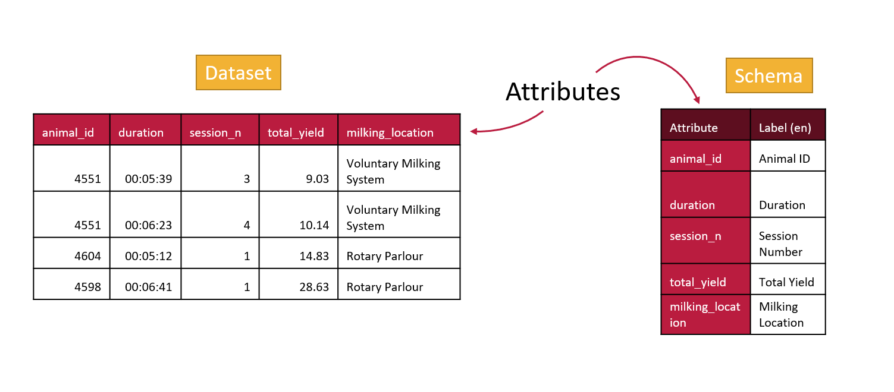

# Schémas de données

Un schéma décrit la structure des données. Un bon schéma vous indiquera ce que sont les libellés des colonnes et ce qu'ils signifient. Il vous indiquera les unités et le type de données contenues dans chaque colonne.

Pour vous aider à comprendre et à utiliser les données, vous avez besoin d'un schéma de données bien documenté.

De meilleurs schémas de données aident les chercheurs à partager les données avec la communauté scientifique. Une meilleure documentation permet aux chercheurs de communiquer efficacement le contexte des données à d'autres utilisateurs, garantissant ainsi que les informations sont utilisées avec précision. Cela est particulièrement utile dans la recherche interdisciplinaire où les autres utilisateurs sont moins familiarisés avec les conventions d'une discipline particulière.

{: .highlight }
Documenter vos données avec un schéma les rend plus ÉQUITABLES.

Les schémas formalisés et lisibles par machine sont très utiles et peuvent être exprimés dans un certain nombre de langages, notamment LinkML, Overlays Capture Architecture (OCA), JSON Schema, XML Schema Definition et JSON-LD. Différents langages de schéma présentent différents avantages, mais le plus grand avantage de l'utilisation de n'importe quel langage de schéma pour documenter un schéma est que le schéma est documenté et dans un format lisible par machine. Les schémas facilitent également le développement d'interfaces d'application (API) et exposent les informations structurelles qui permettent aux utilisateurs d'interroger directement les ensembles de données.

Avec un schéma lisible par machine, vous pouvez l'utiliser pour de nombreuses autres tâches, notamment la vérification, la saisie et l'harmonisation des données. Par exemple, le [moteur sémantique](https://www.semanticengine.org) aide les chercheurs à écrire leurs propres schémas de données à l'aide du langage de schéma OCA. Le [Data Harmonizer](https://github.com/cidgoh/DataHarmonizer) utilise des schémas LinkML personnalisés pour permettre aux chercheurs de modifier et de valider des données tabulaires selon le schéma LinkML.

- écrit par Carly Huitema
