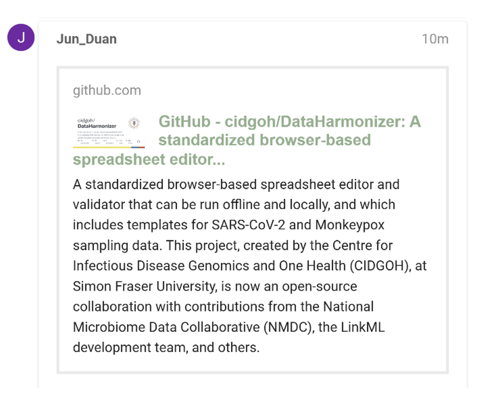
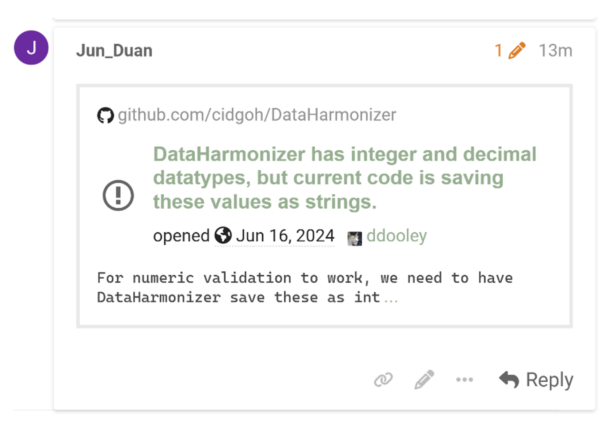
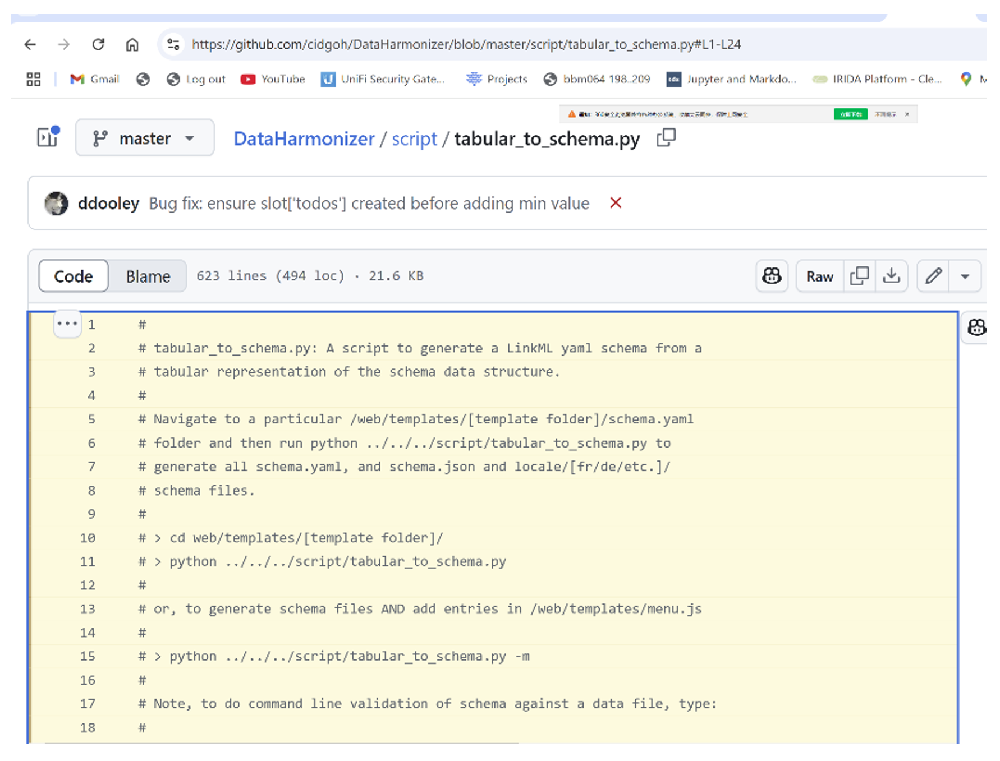
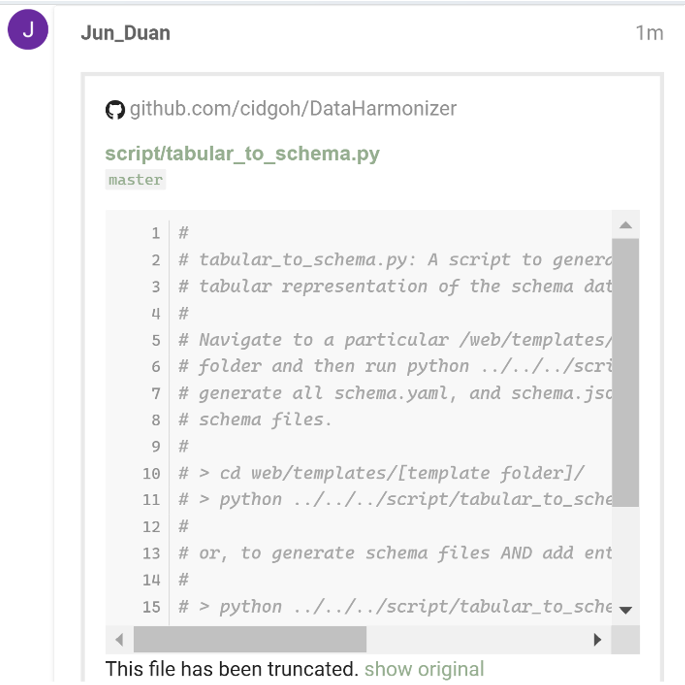

# Citer des dépôts, problèmes et du code GitHub dans Discourse
{: .no_toc }

## Table des matières
{: .no_toc .text-delta }

1. TOC
{:toc}

Comme CS-DCC utilise GitHub pour la gestion du code et le suivi des problèmes, vous aurez souvent besoin de faire référence à du contenu GitHub. Discourse facilite la citation de dépôts, de problèmes et de lignes de code spécifiques — en particulier pour les dépôts publics.

### Citer un dépôt GitHub

- Copiez l’URL du dépôt sur GitHub.
- Collez-la directement dans votre message sur Discourse.  
   Discourse générera automatiquement un aperçu.

Par exemple, voici une citation pour [https://github.com/cidgoh/DataHarmonizer/](https://github.com/cidgoh/DataHarmonizer/)

---

### Citer un problème (Issue) ou une Pull Request

- Copiez l’URL du problème ou de la pull request sur GitHub.
- Collez-la directement dans votre message.

Par exemple, voici une citation pour un problème : [https://github.com/cidgoh/DataHarmonizer/issues/439](https://github.com/cidgoh/DataHarmonizer/issues/439)

---

### Citer une portion de code spécifique

- Ouvrez le fichier dans le dépôt GitHub.
- Cliquez sur un numéro de ligne ou sélectionnez une plage de lignes à mettre en évidence.

- Copiez l’URL dans votre navigateur (elle inclut les numéros de ligne, ex. : https://github.com/cidgoh/DataHarmonizer/blob/master/script/tabular_to_schema.py#L1-L24).
- Collez l’URL dans votre message.

