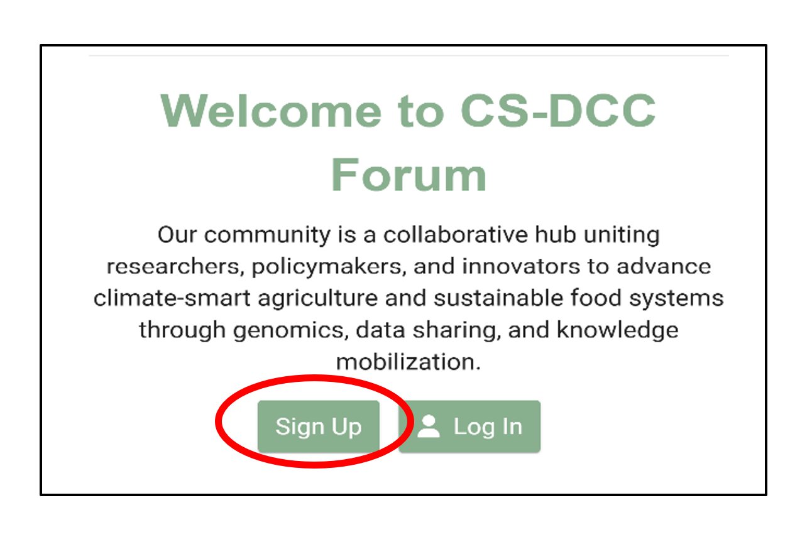
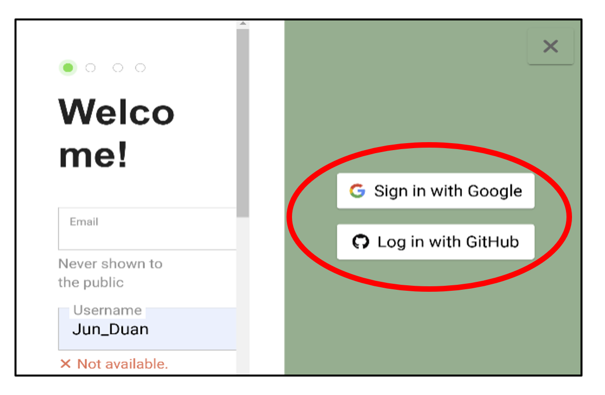
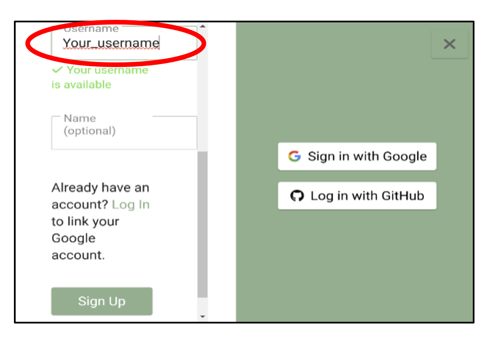
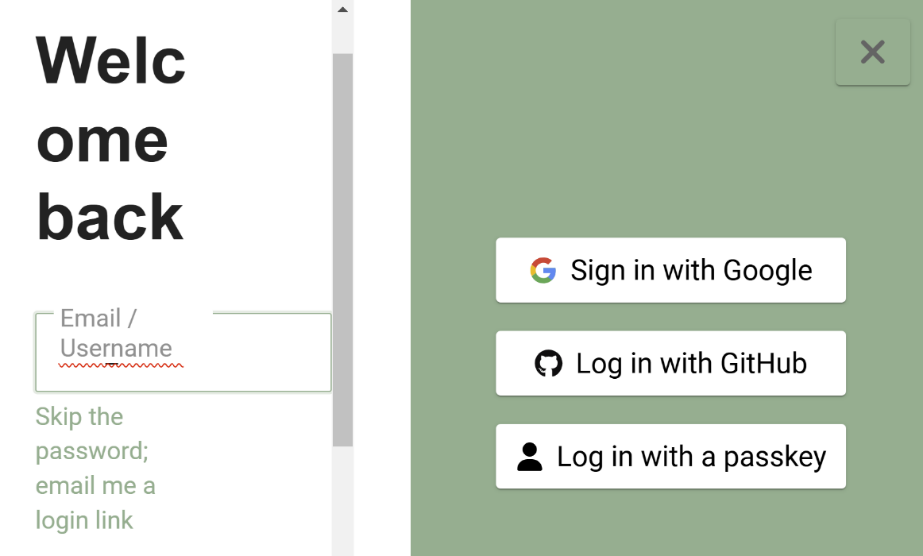
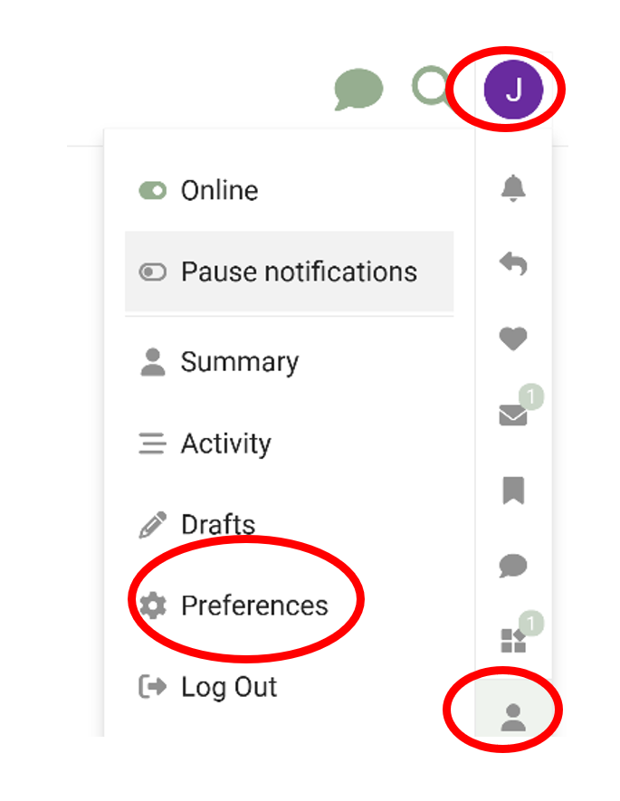

# Commencer avec votre compte
{: .no_toc }

## Table des matières
{: .no_toc .text-delta }

1. TOC
{:toc}

### Visitez le forum

Rendez-vous sur [https://forum.climatesmartagrifood.ca/](https://forum.climatesmartagrifood.ca/)

### Inscription (pour les nouveaux utilisateurs)

- Cliquez sur le bouton **S'inscrire**.

- Sélectionnez **Gmail** ou **GitHub** comme méthode d'inscription.

- Une fois l'authentification terminée, choisissez un nom d'utilisateur et cliquez sur **S'inscrire** pour finaliser la création de votre compte.

- Votre compte sera examiné par un administrateur, puis vous pourrez utiliser le forum une fois qu'il sera approuvé.

### Connexion (pour les utilisateurs existants)

- Cliquez sur le bouton **Se connecter**.
- Sélectionnez **Gmail** ou **GitHub** pour vous connecter avec votre compte approuvé.

### Personnaliser votre profil

- Une fois connecté, cliquez sur votre **nom** en haut à droite de la page.
- Sélectionnez **Profil** dans le menu déroulant, puis cliquez sur **Préférences**.

Sous l'onglet **Profil**, vous pouvez :

- Télécharger une image d'en-tête pour votre profil  
- Ajouter une courte biographie pour vous présenter
