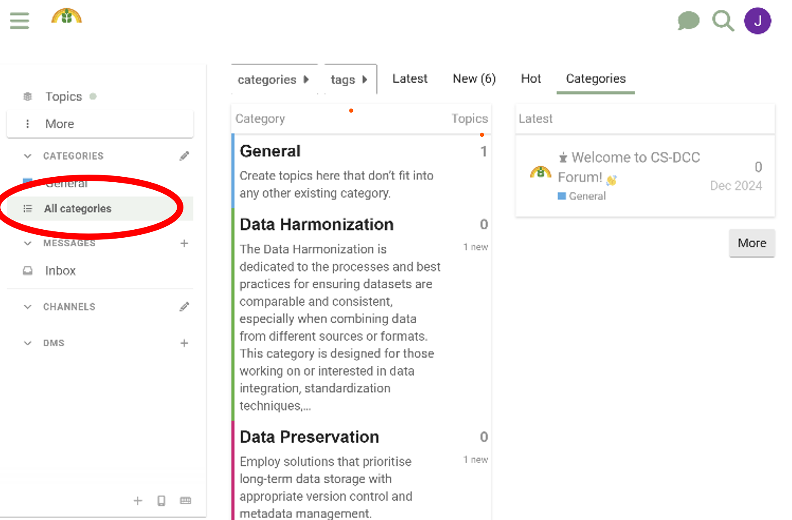
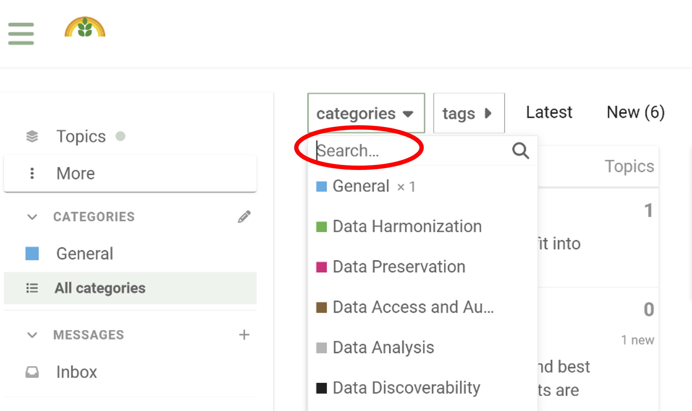
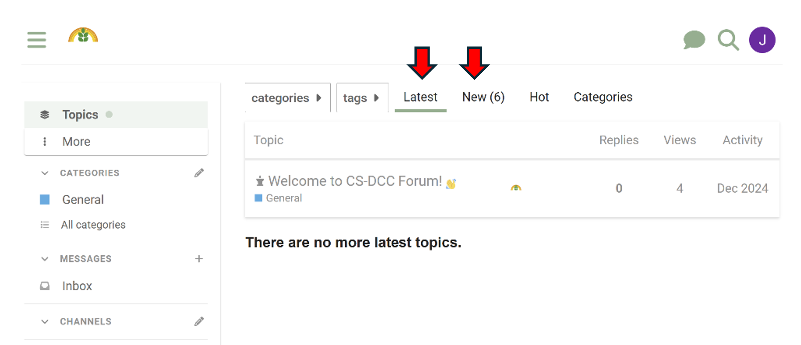

# Navigation dans le forum
{: .no_toc }

## Table des matières
{: .no_toc .text-delta }

1. TOC
{:toc}

### Explorer les catégories

Le forum est organisé en catégories telles que **Harmonisation des données**, **Préservation des données**, **Accès aux données**, et **Authentification**, entre autres. Ces catégories regroupent les publications par sujet d’intérêt.

- Parcourez les publications dans chaque catégorie pour trouver des discussions en lien avec vos centres d'intérêt.

- Vous pouvez également utiliser la barre de **Recherche** en haut de la page pour trouver rapidement des sujets ou discussions spécifiques.

### Derniers et meilleurs messages

- L’onglet **Derniers** affiche les publications et activités les plus récentes dans toutes les catégories.
- L’onglet **Populaires** met en avant les discussions les plus populaires ou les plus actives.

