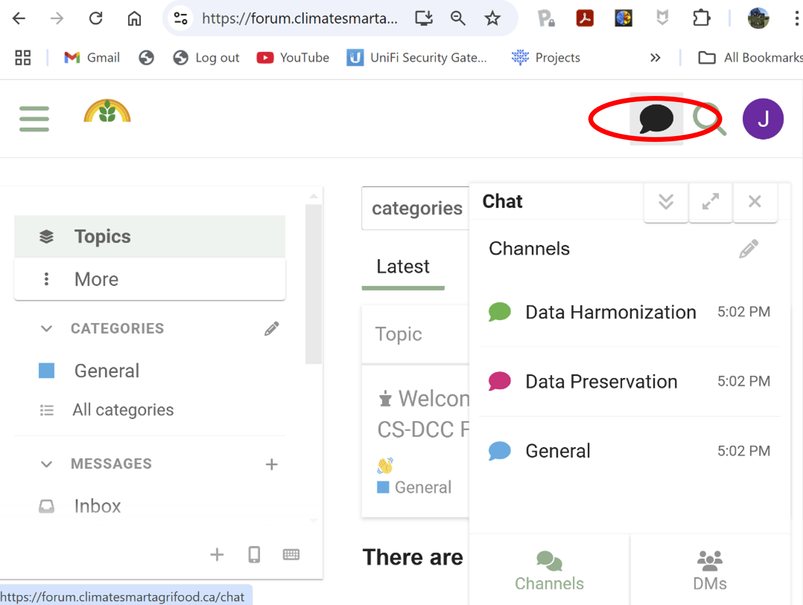
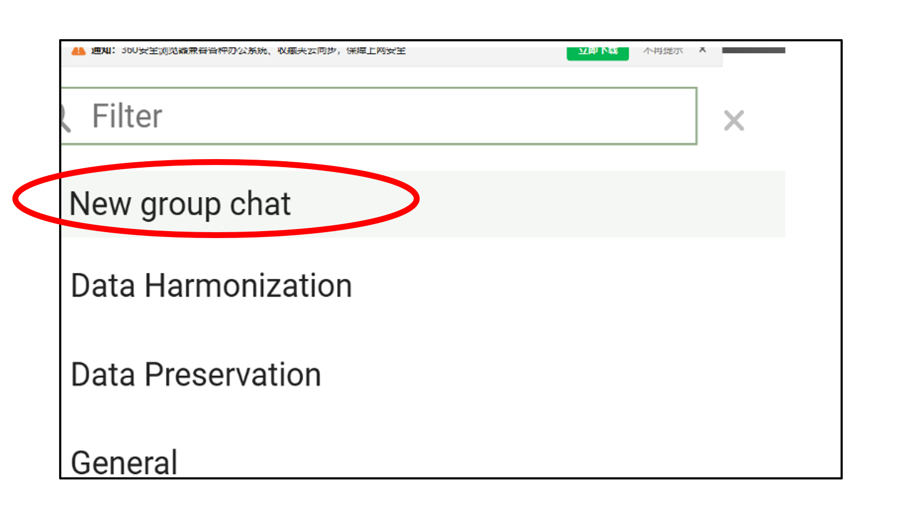
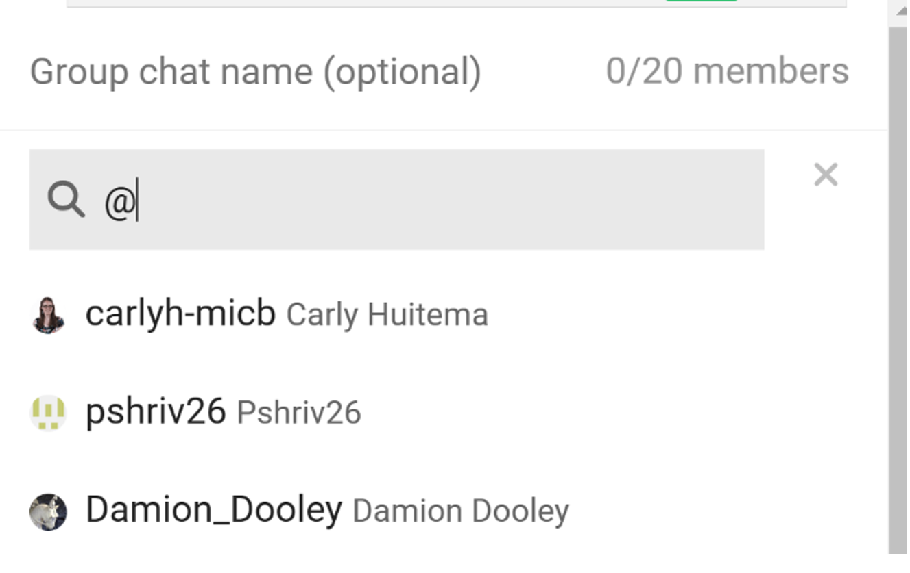

# Participer aux discussions en temps réel via le chat
{: .no_toc }

## Table des matières
{: .no_toc .text-delta }

1. TOC
{:toc}

### Discussion par canal

Les canaux de chat sont des espaces dédiés aux discussions sur des sujets spécifiques. Ils fonctionnent comme des salons où les membres peuvent rejoindre et participer à des conversations thématiques.

**Pour rejoindre un canal :**

- Recherchez l’**icône de chat** (bulle de dialogue) dans la barre de navigation supérieure.
- Cliquez sur l’icône pour ouvrir l’interface de chat, qui affiche la liste des canaux disponibles.

- Sélectionnez un canal et envoyez votre message.

**Astuce :** Mentionnez des utilisateurs en tapant `@nomutilisateur` pour les notifier.

---

### Chat de groupe

Les chats de groupe permettent de créer ou de rejoindre des conversations privées avec un groupe spécifique d’utilisateurs — idéal pour les discussions d’équipe ou les petits groupes.

- Recherchez l’**icône de chat** (bulle de dialogue) dans la barre de navigation supérieure.
- Cliquez dessus pour ouvrir le panneau de chat.
- Dans le panneau de chat, allez à l’onglet **Messages privés (DMs)**.
- Cliquez sur l’icône **Démarrer une conversation**.

- Choisissez **Nouveau chat de groupe**.

- Ajoutez des utilisateurs au chat de groupe.

**Astuces :**  
- Tapez un nom d'utilisateur dans la barre de recherche pour trouver des membres spécifiques.  
- Ou tapez `@` pour afficher une liste d'utilisateurs, puis cliquez sur les noms pour les ajouter.
