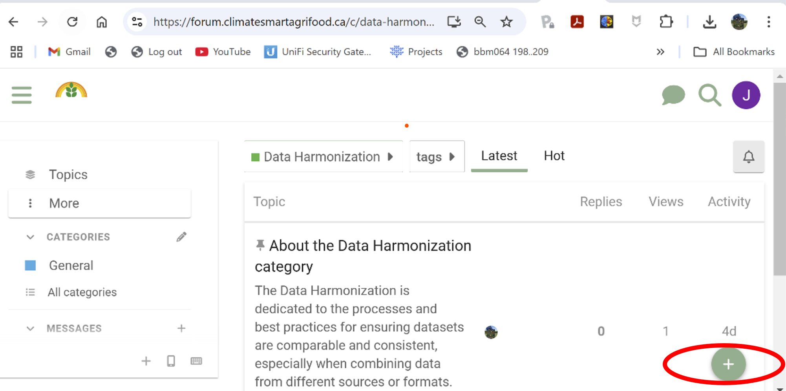
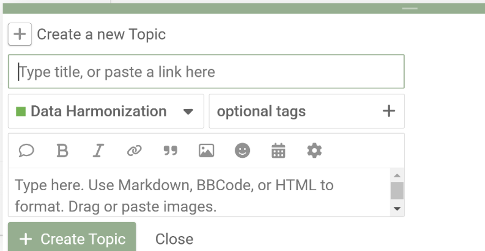
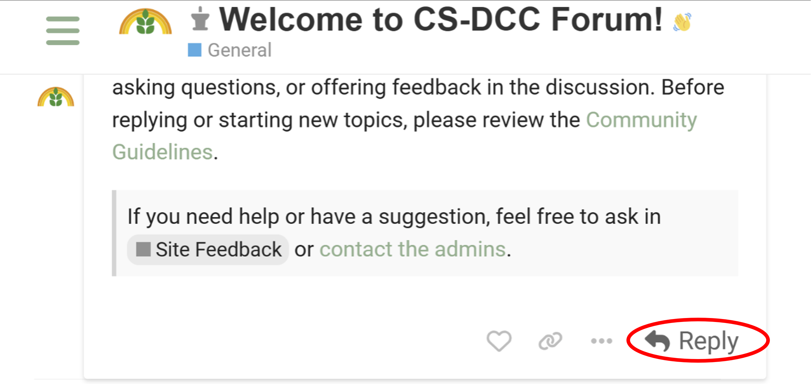

# Participer aux discussions
{: .no_toc }

## Table des matières
{: .no_toc .text-delta }

1. TOC
{:toc}

### Créer un nouveau sujet

Pour démarrer une nouvelle discussion :

- Allez dans la catégorie pertinente et cliquez sur **Nouveau sujet**  
   - Parcourez le forum pour trouver la catégorie correspondant à votre sujet (ex. : **Harmonisation des données**, **Préservation des données**).
- Cliquez sur **Nouveau sujet**

- Ajoutez un **titre** et un **contenu**  
   - Fournissez un titre descriptif qui résume bien votre sujet.  
   - Rédigez votre message dans la zone de texte prévue. Utilisez les outils de mise en forme pour améliorer votre contenu.

**Astuce :**

- Les **étiquettes (tags)** aident à catégoriser votre sujet et facilitent la recherche de discussions similaires. Vous pouvez ajouter des étiquettes pertinentes lors de la création de votre sujet. De nouvelles étiquettes sont créées lors de leur première utilisation.
- Vous pouvez cliquer sur la **cloche de notification** d’un sujet pour le définir comme **Surveillé**, **Suivi** ou **Muet**.

---

### Comment répondre aux publications

#### Répondre directement sur la plateforme

- Connectez-vous à la plateforme Discourse et accédez au sujet ou message auquel vous souhaitez répondre.

#### Répondre par courriel

- Lorsqu'une personne répond à un message que vous suivez, un **courriel de notification** vous est envoyé.
- Il vous suffit de **répondre directement au courriel**. Après quelques minutes, votre réponse sera automatiquement publiée dans le fil de discussion Discourse.

**Astuce :**

- Vous pouvez taper `@` suivi du nom d'utilisateur pour notifier quelqu’un (ex. : `@nomutilisateur`).
- Vous pouvez **joindre des fichiers ou des images** à votre réponse par courriel. Ils seront téléchargés dans le fil avec votre réponse.
- La mise en forme de base (comme le **gras** ou *l’italique*) peut être conservée selon votre client de messagerie.
