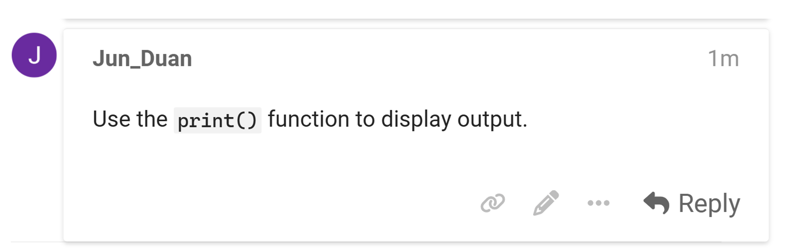
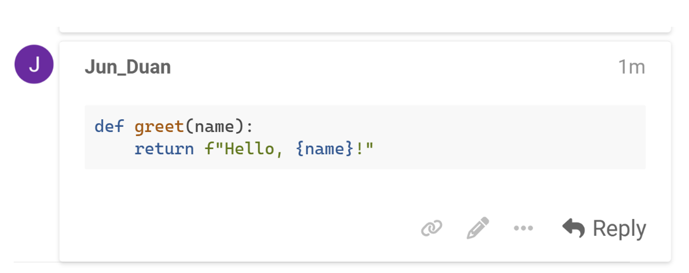
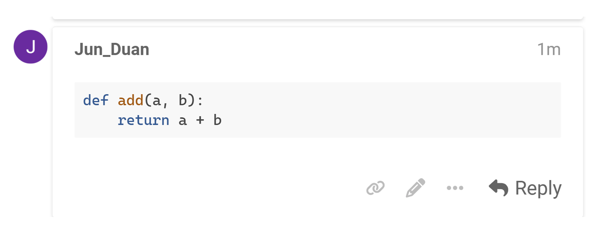

# Utiliser Markdown pour insérer du code
{: .no_toc }

## Table des matières
{: .no_toc .text-delta }

1. TOC
{:toc}

Pour afficher du code directement dans votre message, utilisez la syntaxe Markdown de Discourse :

### Code en ligne

Pour formater une courte portion de code dans une phrase, encadrez simplement le code avec des accents graves simples (`).

Par exemple :

Utilisez la fonction `print()` pour afficher un résultat.



### Blocs de code

Pour afficher un bloc de code plus long, utilisez trois accents graves (```) avant et après le code.

Par exemple :



**Conseils** : Pour activer la coloration syntaxique, indiquez le langage après les trois accents graves d’ouverture. Discourse prend en charge les langages populaires comme Python, JavaScript, HTML, et bien d’autres.

Par exemple :

```python
def add(a, b):
    return a + b


