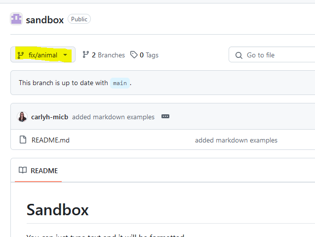
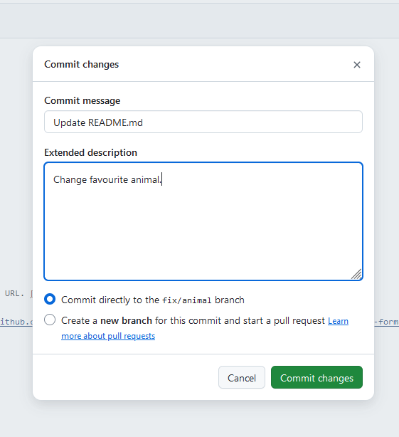
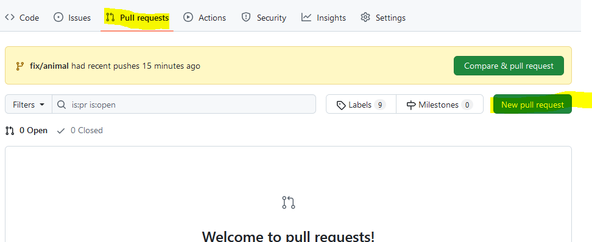
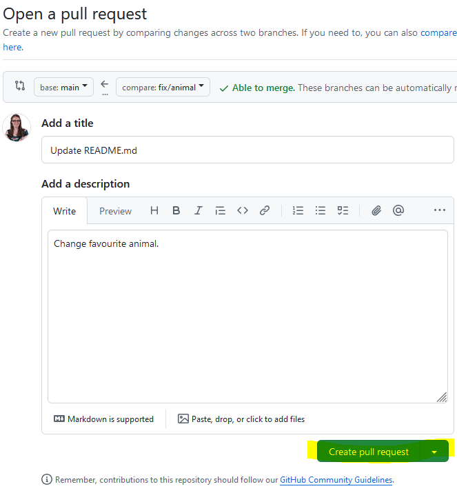
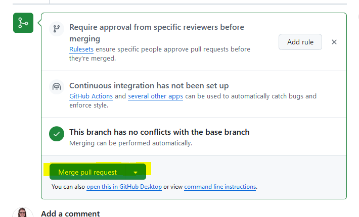
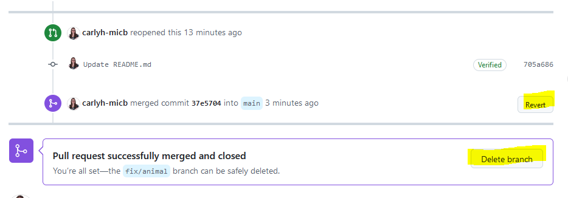

# Branches GitHub
{: .no_toc }

## Table des matières
{: .no_toc .text-delta }

1. TOC
{:toc}

Les branches dans GitHub permettent aux équipes de travailler simultanément sur différentes 
versions de la documentation sans affecter la version principale. Elles permettent l'expérimentation, 
les mises à jour de contenu ou les révisions importantes de manière isolée. Une fois les modifications 
finalisées et examinées, elles peuvent être fusionnées dans la branche principale, garantissant 
ainsi que la documentation principale reste stable pendant le développement des mises à jour. 
Cette approche prend en charge la collaboration, le contrôle des versions et une intégration 
plus fluide des modifications.

## Un scénario avec ramification

Examinez ce scénario, puis lisez la suite pour en savoir plus : vous collaborez au développement 
d'une norme (comme un vocabulaire contrôlé). Votre groupe a déjà publié une version et vous travaillez 
sur la prochaine version qui se trouve sur sa propre branche « prochaine version ». Pour effectuer vos modifications, 
vous créez d'abord votre branche d'édition à partir de cette branche de prochaine version et effectuez les modifications. 
Vous validez vos modifications dans votre branche, puis vous faites une demande de tirage (*Pull Request* ou *PR*) pour que 
vos modifications soient acceptées dans la branche de prochaine version. Lors de la prochaine révision programmée, votre 
groupe passe en revue toutes les PR, lit les descriptions, examine les modifications et décide s'il acceptera les modifications 
ou renverra le travail avec des commentaires. Vos modifications sont acceptées et votre branche est fusionnée dans la branche 
de prochaine version. Lorsque la branche de prochaine version est finalisée, vous publierez la prochaine version de votre 
vocabulaire contrôlé à partir de ce travail.

## Noms de branches

Déterminer les conventions de dénomination des branches peut faciliter grandement la gestion de votre travail. 
Par exemple, décidez de quelques catégories de noms de branches (par exemple, correctif, nouveau, 
fonctionnalité, etc.) et utilisez-les comme termes pour le début de votre nom de branche. Séparez votre 
catégorie de branche des détails par un /. par exemple fix/animal serait un nom de branche.

## Créer une branche

Après avoir décidé du nom de votre branche, il est temps de la créer. Une façon de la créer est de cliquer sur 
le bouton de branche, de saisir votre nouveau nom et de sélectionner « Créer une branche fix/animal à partir de 
la branche principale ». Voir l'image ci-dessous pour l'exemple.

Après avoir créé une branche, vous pouvez la retrouver, ainsi que d'autres, sur le bouton de branche. 
Dans l'exemple ci-dessus, la branche a été créée à partir de la branche principale, mais si vous travailliez 
sur une nouvelle version (par exemple, la branche release/v2), votre branche pourrait être à la place de cette 
branche de la prochaine version.

Si vous travaillez dans GitHub et que vous ne trouvez pas les modifications que vous étiez sûr d'avoir 
apportées, assurez-vous de vérifier sur quelle branche vous vous trouvez actuellement !

## Modifier les fichiers dans une branche

Après avoir vérifié sur quelle branche vous vous trouvez, vous pouvez y accéder et apporter des modifications 
aux fichiers. Lorsque vous avez terminé vos modifications, vous cliquerez sur « Valider les modifications... » 
comme précédemment. Ajoutez votre message de validation et votre description et vérifiez que vous ajoutez votre 
validation à la bonne branche avant de valider vos modifications. Dans cette fenêtre, vous pouvez également voir 
que vous pouvez créer une nouvelle branche à la place. C'est une autre façon de créer une branche : effectuez 
d'abord les modifications, puis validez sur une nouvelle branche.

Après avoir validé les modifications, vous pouvez comparer les modifications en changeant de branche. 
Vous pouvez vérifier que vos nouvelles modifications sont limitées à la branche actuelle sur laquelle vous vous trouvez.

## Lancer une Demande de Tirage (Pull Request)

* Une **Demande de Tirage** est une demande formelle de fusion des modifications d'une branche 
(comme fix/animal dans notre exemple) dans une autre branche (souvent la branche principale ou 
master ou release/v2 dans notre exemple). _Objectif_ : proposer, examiner et discuter des modifications 
avant qu'elles ne soient fusionnées dans la base de code principale. Cela permet aux autres membres de 
l'équipe de réviser votre code, de le commenter et de demander des modifications si nécessaire.

Pour fusionner vos modifications, vous devez effectuer une Demande de tiraqe dans GitHub. Vous ne 
transférez pas vos modifications sur l'autre branche, vous demandez que vos modifications soient 
intégrées.

Cliquez sur « Pull requests » et créez une « New pull request ».

Vous allez maintenant choisir la branche que vous souhaitez fusionner dans la branche hôte 
(dans cet exemple, fusion de la branche fix/animal dans la branche main). Ci-dessous, vous 
verrez tous les changements entre les deux, ce qui vous aide à décider s'il s'agit de la PR 
que vous souhaitez générer. Sélectionnez « Créer une pull request ».

Pendant que vous avez pris des notes sur chaque commit que vous faites tout au long du processus, 
lorsqu'il s'agit de la PR, il est temps d'écrire vos commentaires récapitulatifs sur la PR. 
Rédiger une bonne PR aidera la communauté (ou vous) à comprendre exactement ce que vous 
faisiez et pourquoi. Sélectionnez « Créer une demande de tirage ».

Vous avez maintenant créé votre demande de tirage (en supposant que vous n'ayez aucun conflit 
dont nous parlerons plus tard). Vous pouvez vous arrêter ici et votre demande de tirage a été 
ajoutée à la file d'attente des PR. Vous voudrez peut-être vous arrêter ici car c'est le bon 
moment pour que quelqu'un d'autre révise votre écriture/code. Surtout si vous collaborez sur 
es documents, quand vient le temps de fusionner avec l'une des branches les plus importantes 
(comme votre branche principale ou une branche de publication), votre communauté peut vouloir 
se réunir pour examiner les PR, prendre des décisions quant à savoir s'ils doivent être fusionnés 
ou renvoyés avec des commentaires pour plus de révisions avant la fusion.

Si vous effectuez d'autres commits sur une branche après qu'un PR a été effectué, ces commits 
ultérieurs sont également ajoutés au PR. Si vous souhaitez enregistrer de nouvelles modifications 
et que vous ne voulez pas qu'elles soient ajoutées au PR ouvert, vous devrez créer une nouvelle branche.

## Examiner une demande de tirage

Si vous travaillez en collaboration sur un projet, vous souhaiterez examiner les PR et laisser 
des commentaires. Si vous n'acceptez pas un PR et pensez que d'autres modifications sont 
nécessaires, vous pouvez faire ces commentaires et sélectionner « Fermer avec commentaire ».

Les branches peuvent être développées plus avant, les PR peuvent être rouvertes et réévaluées 
et finalement un PR sera accepté.

## Fusionner une demande de tirage

Une fois que vous avez décidé d'accepter toutes les modifications d'une demande de tirage, 
vous pouvez fusionner la demande de tirage (et confirmer la fusion).

Une fois qu'une branche a été fusionnée, vous pouvez choisir de supprimer la branche source 
(par exemple, supprimer la branche fix/animal). Les modifications ont été ajoutées à la branche 
principale et la suppression des branches terminées permet de garder le projet clair et ordonné. 
Si vous avez fait une erreur, vous pouvez également annuler la fusion. Cela ne supprime pas 
toutes les modifications de votre historique de validation, mais cela rejoue à l'envers les 
modifications que vous avez apportées et vous pouvez annuler la fusion.

## Conflits de fusion

Les conflits de fusion se produisent lorsque vous essayez de fusionner des branches qui ont des commits 
concurrents, par exemple si deux personnes essaient de modifier la même ligne du fichier. Le site de 
documentation officiel de GitHub propose une excellente analyse de 
[comment résoudre les conflits de fusion](https://docs.github.com/en/pull-requests/collaborating-with-pull-requests/addressing-merge-conflicts/resolving-a-merge-conflict-on-github).

## Duplication

Que se passe-t-il si vous contribuez à un référentiel standard/de documentation mais que vous n'avez pas les 
autorisations pour travailler dans ce référentiel ? Il s'agit d'un modèle très courant pour travailler sur 
des projets collaboratifs à l'aide de GitHub.

Pour collaborer sur des projets, vous devez créer une duplication du référentiel dans votre référentiel personnel 
(ou dans une organisation dont vous êtes membre). Ensuite, vous y apportez des modifications et vous pouvez faire 
des Demande de Tirage depuis votre dépôt vers le dépôt source (alias en amont). Lisez les détails sur le 
[site de documentation GitHub](https://docs.github.com/en/pull-requests/collaborating-with-pull-requests/working-with-forks/about-forks).

## Résumé

Vous disposez désormais des outils pour travailler en collaboration sur le projet partagé à l'aide de GitHub. 
Qu'il s'agisse de code ou de documentation, GitHub vous permet de créer des branches pour explorer le travail, 
de générer des PR pour fusionner votre travail et, finalement, de fusionner votre travail dans les branches 
officielles des projets en cours. Si vous travaillez seul, vous n'aurez pas besoin d'attendre l'approbation 
avant de fusionner. Sans ajouter de règles de protection des branches (non abordées dans ce tutoriel), vous 
verrez que vous pouvez générer des PR et fusionner sans attendre l'approbation. Avec GitHub, toutes les 
modifications sont enregistrées dans l'enregistrement de validation, vous pourrez donc toujours aller voir 
qui a effectué les modifications et quelles ont été ces modifications.

## Autres ressources

Ceux qui recherchent une analyse approfondie des modèles de ramification GitHub peuvent lire [Un modèle de ramification Git réussi](https://nvie.com/posts/a-successful-git-branching-model/) qui se concentre sur le code mais qui pourrait également être pertinent pour les projets de documentation (où les bugs=typos par exemple).

Vous trouverez plus de détails sur la collaboration avec GitHub sur le site de documentation [OBO Semantic Engineering Training](https://oboacademy.github.io/obook/tutorial/github-fundamentals/).

- écrit par Carly Huitema

