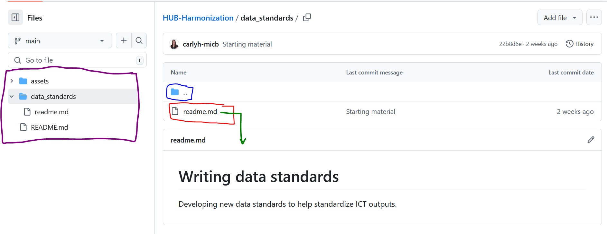
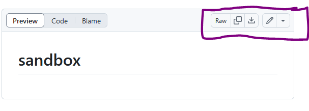
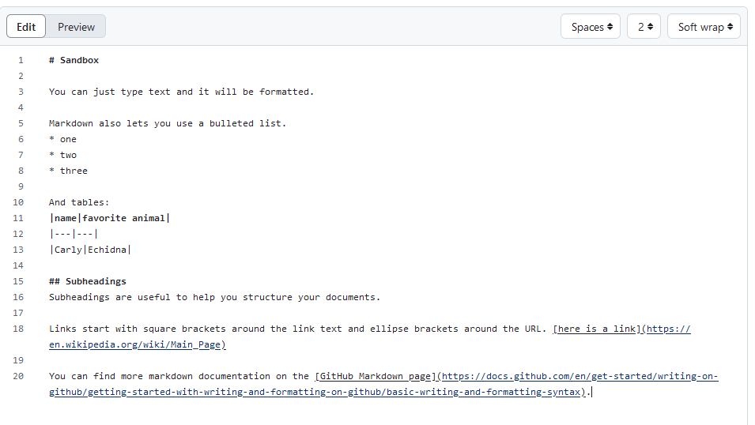
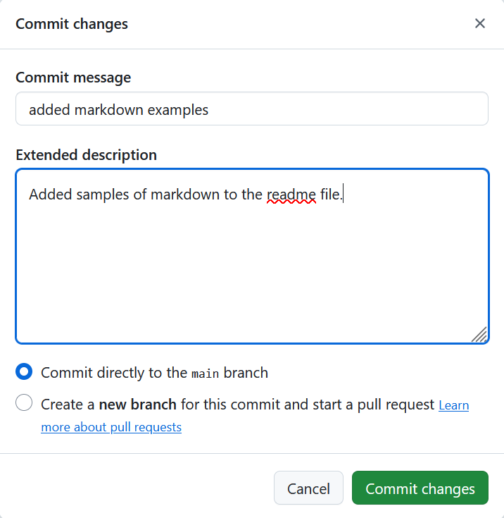

# Présentation d'un référentiel GitHub
{: .no_toc }

## Table des matières
{: .no_toc .text-delta }

1. TOC
{:toc}

Commencez à apprendre à utiliser GitHub ici.

## Orientation et navigation

Un référentiel GitHub est l'endroit où vous pouvez stocker tous les actifs d'un projet. GitHub est extrêmement efficace pour gérer le contrôle de version des fichiers texte. En général, GitHub est utilisé pour la gestion du code, mais GitHub peut également être très utile pour gérer le développement de normes.

Étant donné que GitHub est si souvent utilisé par les codeurs, le matériel d'aide est généralement écrit par des développeurs pour des développeurs.

Ce guide est écrit pour les personnes qui ne sont généralement pas des codeurs mais qui souhaitent bénéficier de certaines des fonctionnalités intéressantes que GitHub peut offrir.

Vous trouverez ci-dessous un exemple de référentiel GitHub. Un référentiel contient généralement tous les fichiers liés à un projet. Pour les personnes qui écrivent et partagent des normes de données (ou des ontologies ou d'autres documents textuels), un référentiel peut contenir les informations relatives à une norme de données.

Le nom de ce référentiel illustré ci-dessus s'appelle HUB-Harmonization. Il s'agit d'un référentiel public, ce qui signifie que toute personne sur le Web peut le voir, mais que seules les personnes autorisées pourront le modifier.

Dans la case violette se trouve une description écrite par le propriétaire du référentiel qui décrit ce qu'il contient.

Dans la case bleue sont mis en surbrillance les dossiers/répertoires et les fichiers qui appartiennent au référentiel. À côté d'eux, dans la case rouge, se trouvent les notes prises par la dernière personne qui a modifié le fichier ou le dossier.

En général, dans les fichiers d'un référentiel se trouve un fichier appelé README.md. GitHub reconnaît qu'un fichier readme est spécial et affichera le contenu du fichier readme par défaut dans la zone ci-dessous (indiquée par la flèche verte).

Si vous cliquez sur le dossier `data_standards`, vous pouvez voir quels documents ont été ajoutés à ce dossier.

Après avoir cliqué sur `data_standards`, vous entrez dans la vue des fichiers où vous pouvez parcourir le contenu du référentiel. Dans le dossier/répertoire `data_standards`, il y a un autre readme.md (case rouge), qui est reconnu par GitHub et le contenu affiché par défaut ci-dessous (flèche verte).

Sur la gauche se trouve la navigation des fichiers (case violette) où vous pouvez parcourir la structure du référentiel. Dans la case bleue se trouve un dossier avec deux points `..` où cliquer dessus vous fera remonter d'un dossier/répertoire.

## Écrire et enregistrer dans GitHub en utilisant la page Web

La façon la plus simple de travailler avec GitHub est d'effectuer toutes vos modifications directement dans la page Web. De nombreuses pages utiles sur Internet parlent de Git CLI (Command Line Interface) ou de GitHub Desktop, mais toutes sortes de progrès peuvent être réalisés dans GitHub simplement via l'interface Web.

Dans le [référentiel Sandbox](https://github.com/ClimateSmartAgCollab/sandbox) de l'organisation ClimateSmartAgCollab, ou dans votre propre référentiel personnel, vous pouvez modifier le fichier markdown readme.md.

Dans la case violette, de gauche à droite, Raw=regardez le code brut et non la version bien formatée que vous voyez actuellement, deux cases=copier, flèche vers le bas=télécharger le fichier et le crayon vous permet de modifier le fichier.

Cliquez sur l'icône en forme de crayon pour commencer à modifier le fichier markdown readme directement dans votre navigateur Web.

Vous trouverez ici du texte écrit en Markdown. Si vous cliquez sur le bouton d'aperçu, vous pouvez prévisualiser la façon dont le markdown sera formaté. Essayez d'ajouter votre nom et votre animal préféré au tableau. Si le tableau n'est pas là, regardez comment il est écrit dans l'image ci-dessus et recréez-le.

Vous pouvez en savoir plus sur l'écriture en markdown sur la [page GitHub Markdown](https://docs.github.com/en/get-started/writing-on-github/getting-started-with-writing-and-formatting-on-github/basic-writing-and-formatting-syntax).

### Enregistrement sur la page Web GitHub
Enfin, comment enregistrer vos résultats dans GitHub ?

Dans l'interface Web, le bouton vert « Valider les modifications... » permet de sauvegarder votre travail. En cliquant sur le bouton « Valider les modifications... », la boîte de dialogue Valider les modifications apparaît (illustrée ci-dessous).

Étant donné que GitHub est un environnement très collaboratif, lorsque vous validez les modifications, vous pouvez écrire des messages à la communauté sur les modifications que vous avez apportées et sur les raisons qui vous ont motivées. Parfois, si vous devez annuler un travail, il peut être très utile d'avoir de bons messages de validation et de bonnes descriptions. Dans un environnement de développement encore plus formalisé où les validations doivent être examinées avant d'être acceptées (par exemple lors du développement d'une norme officielle), de bons messages de validation peuvent faciliter le processus d'approbation.

Après avoir écrit votre message et votre description, vous validerez directement dans la branche principale. Vous pouvez accomplir beaucoup de choses dans GitHub en utilisant uniquement la branche principale. Les branches sont un excellent outil lorsque vous souhaitez avoir votre document principal et officiel sur Main, et vous pouvez créer des branches lorsque vous souhaitez travailler sur la prochaine version avant qu'elle ne devienne officielle.

Validez vos modifications directement sur la branche principale et appuyez sur le bouton vert « Valider les modifications » pour enregistrer votre travail dans GitHub. Vous et toutes les autres personnes ayant accès au référentiel pouvez désormais consulter votre travail.

## Création de nouveaux fichiers et dossiers dans la page Web GitHub

Sur la page de code principale de GitHub (cliquez sur <>Code en haut de la page pour y accéder), vous pouvez ajouter des fichiers soit en créant un nouveau fichier (un nouveau fichier texte), soit en téléchargeant un fichier. Donnez un nom à votre nouveau fichier dans la case « Nommez votre fichier... » et une extension de nom de fichier (par exemple .md pour un fichier markdown).

Dans la case « Nommez votre fichier … », vous pouvez également modifier le dossier dans lequel vous souhaitez placer votre nouveau fichier. Si vous souhaitez que votre nouveau fichier `filename.seq` soit dans un dossier/répertoire appelé « séquences », saisissez `sequences/filename.seq`. Lorsque vous saisissez la barre oblique /, vous créez automatiquement le nouveau dossier/répertoire.

Oups, vous avez peut-être mal orthographié le nom de votre dossier, comment l'annuler ? Vous pouvez revenir en arrière à partir du début du nom de fichier ou saisir `../` dans la case « Nommez votre fichier … » (rappelez-vous que les doubles points `..` signifient remonter d'un répertoire), et vous remonterez d'un niveau de dossier et vous pourrez maintenant saisir correctement le nom de votre dossier.

Si vous avez téléchargé une image et que vous souhaitez la placer dans le dossier des images, vous devez attendre qu'elle soit téléchargée. Cliquez ensuite sur l'icône en forme de crayon pour modifier le fichier. Vous ne pouvez pas modifier directement le fichier image car il s'agit d'un fichier binaire, mais vous pouvez modifier le nom. Ajoutez au début de votre nom de fichier `images/` et vous placerez votre fichier dans un nouveau répertoire d'images.

- écrit par Carly Huitema

